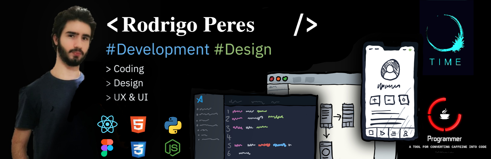

# Rodrigo Peres
## Sobre mim - About Me

> [English]
>  
> I'm Rodrigo from Brazil, and I do content on Design and Development. I really enjoy learning languages and frameworks like React and React Native, as well as Python. I also enjoy wireframing, ui, ux, and design in general. 

> [Português]
>  
> Meu nome é Rodrigo, sou do brasileiro, e faço conteúdo sobre Design e Desenvolvimento. Eu realmente gosto de aprender linguagens e estruturas como React e React Native, bem como Python. Também gosto de wireframing, ui, ux e design em geral.

⠀

## Skills and Experience
>   ReactJS  
>   React Native  
>   Typescript  

>   HTML   
>   CSS  
>   Javascript  

>   MongoDB  
>   Git  
>   NodeJS  

⠀

## Site
https://roperes98.github.io

⠀

## Examples of Work

⠀
## Status and Social Media

⠀
⠀
⠀
  