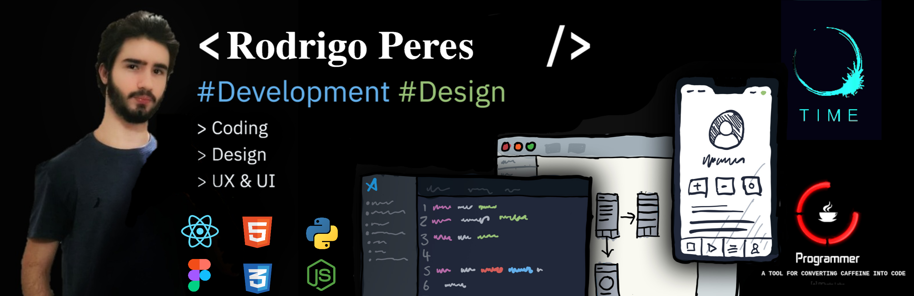

# Rodrigo Peres
## About Me

I am a full-stack developer with a passion for building scalable, performant web and mobile applications. My primary areas of expertise are ReactJS, React Native, and Node.js.

I have experience building and maintaining a wide range of applications, from simple static websites to complex, data-driven web and mobile applications. I am comfortable working with a variety of technologies and frameworks, including Git, HTML, CSS, JavaScript, and various back-end technologies such as Node.js and Express.

## Skills and Experience
>   ReactJS  
>   React Native  
>   Typescript  

>   HTML   
>   CSS  
>   Javascript  

>   MongoDB  
>   Git  
>   NodeJS  

<!-- ## Site
https://roperes98.github.io

⠀ -->

⠀
⠀
⠀
  
